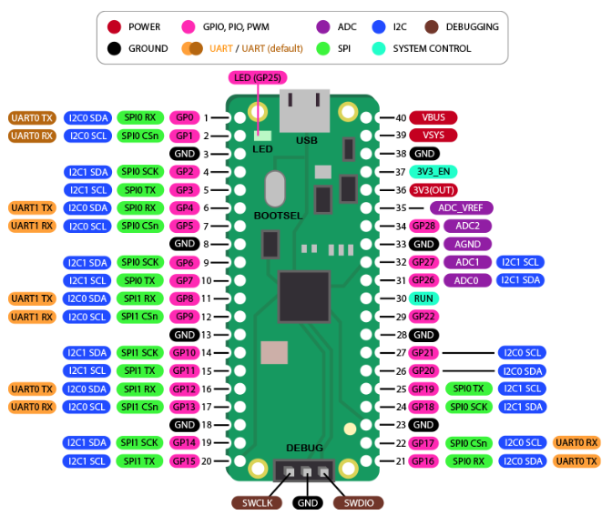
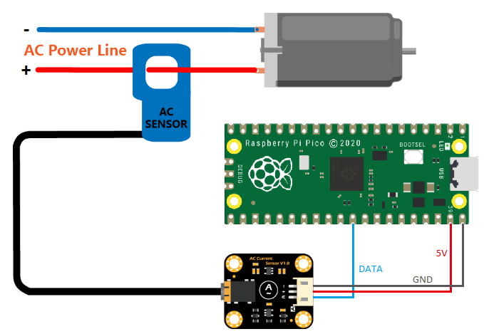
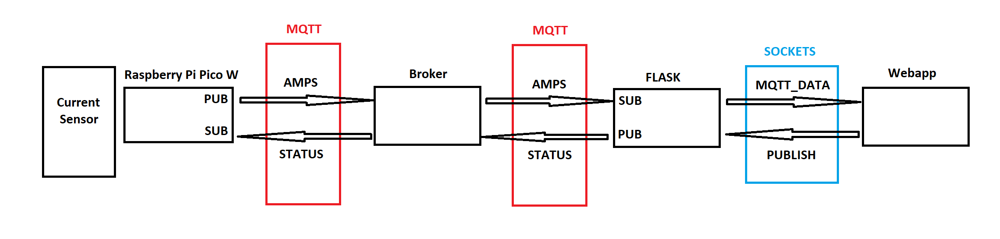
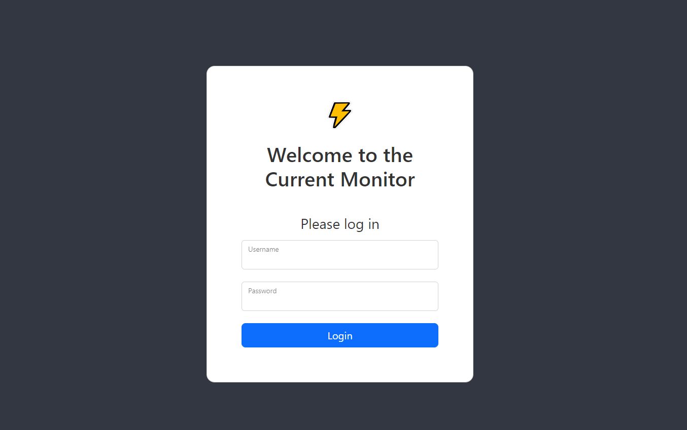
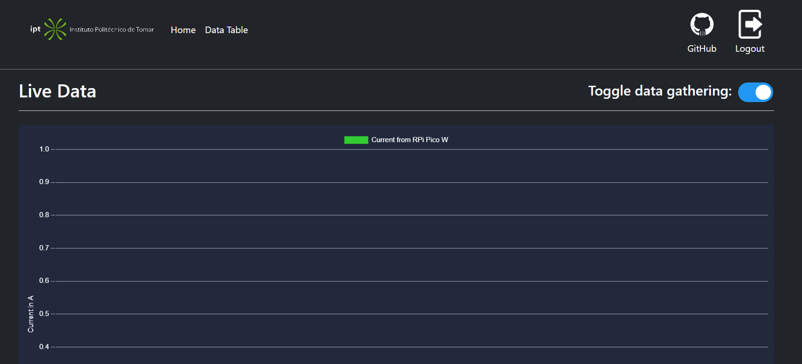
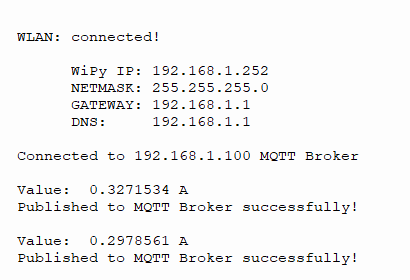
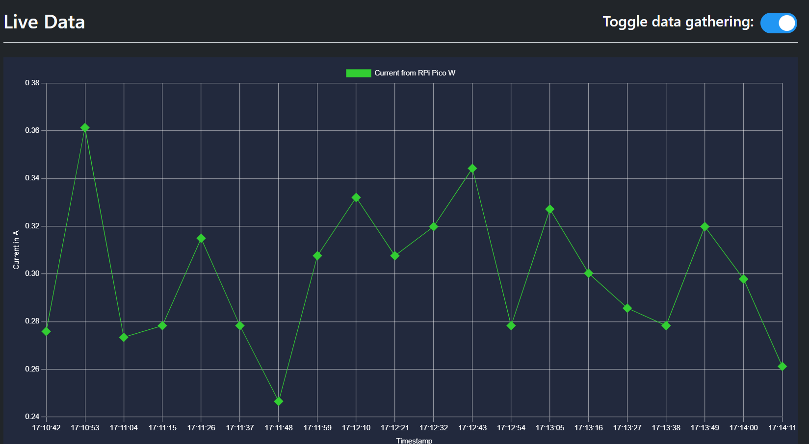
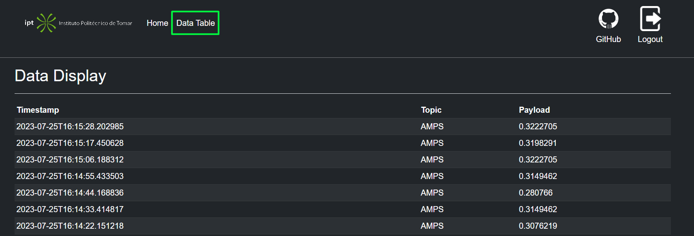

# Problem:
For the Networks and Infrastructures Course, we had to carry out a Final Project, which was based on the following question: How to create an automation system using Raspberry Pi, MQTT protocol, a sensor of our choice depending on the project idea that allows precise data detection, such as electrical current (which was our case), and actuation on devices, with the ability for secure remote access for real-time control and monitoring? The system should ensure the security of transferred data through the implementation of MQTT and user authentication, as well as securely store sensor data logs and executed actions.

# Requirements:
* Provisioning: Properly configure the Broker, which in our case was done through Vagrant, to enable efficient communication and management between IoT devices and the server. Additionally, it is necessary to connect IoT devices to the existing Wi-Fi network, providing the correct information such as SSID and PSK.✅  
  
* Sensing and Actuation: Implement the functionality of precise data detection and actuation (e.g., turning on/off an LED). This requires selecting and configuring the sensors correctly, ensuring accurate readings and performing actions as expected.✅ 

* Automation of Actions: Implement the automation logic based on defined conditions and somehow notify the client when certain sensor values reach unexpected data.✅

* Security: Implement security measures to protect data transfer, such as using SSH. It is also important to consider user authentication to ensure that only authorized individuals can access and control IoT devices.✅

* Remote Access: Configure remote access to the project to enable control and monitoring of IoT devices from anywhere. The use of ngrok helps expose the local server to the internet, allowing external communication.✅


# CurrentMonitor
MSc Project that consists in a Current Monitor using a Raspberry Pi Pico W.  
The objective of this project is to use concepts from MQTT (Publisher, Broker & Subscriber). The `Publisher`, our `Raspberry Pi Pico W`, publishes the values read by an AC Current Sensor to a `Broker` hosted in a VM. That very same VM will also host a webserver to which anyone can access to `Subscribe` to the content.

---
## What material do I need?
* To replicate this project you will need:  
  1. A Raspberry Pi Pico W -> [Information](https://www.raspberrypi.com/documentation/microcontrollers/raspberry-pi-pico.html)
  2. An Analog Current Sensor -> [Like this one](https://www.dfrobot.com/product-1486.html)
  3. A Breadboard
  4. Some connector cables
  5. A source of AC current
   
---
## Is there anything I need to know?
* It is important to know some aspects about our `Raspberry Pi Pico W`:



* Relevant information for the context of the project:
  * Pins:
    * 39 - VSYS -> This is the input voltage, which can range from 2 to 5-volts, which is the Vcc pin we need/have to use since we need 5V to power the sensor.
    * 38 - GND -> A ground pin like any other, I just picked this one because it is close to the Vcc one (Yeah that's the reason 😎).
    * 31 - ADC0 -> We need a Analog pin for the data gathered by the sensor, which means we have 3 options (Pins: 31, 32 and 34).
  * Vagrant:
    * The VM we are going to be using is launched via [Vagrant](https://developer.hashicorp.com/vagrant).
      * This means:
          1. You need to [install VirtualBox](https://www.virtualbox.org/)
          2. You need to [install Vagrant](https://developer.hashicorp.com/vagrant/downloads), if you don't have it already.
          3. After installing all you have to do is:
             1. Run `vagrant up` in any terminal. This will create the VM according to the specifications in the `Vagrantfile` and the Shell scripts under `/scripts`.         
                > **Note**  
                > When running `vagrant up` make sure you are under the same directory as the `Vagrantfile` or else it won't work.  
                Additionally sometimes it is a good idea to run `vagrant provision` to force the execution of the shell scripts.
             2. When that is done if you want to access the VM's terminal all you have to do is run `vagrant ssh`.
                > **Note**  
                > If you want to exit the ssh all you have to do is run `exit` in the VM terminal. Additionally to turn off the VM simply run `vagrant halt` under the same directory as the `Vagrantfile`


---
## How do I put together all the physical components?
* Here is the connection diagram:  



> **Warning**  
> You can only use the AC current sensor to clamp one of the terminals (positive or negative, it it the same) of your AC source, since they cancel each other out and if you were to clamp both you would be reading a null (as in 0) value.

---
## Project Structure

This project will have three major parts:
* Sensor + Raspberry Pi Pico W
  * This will act as a way to read the current value and publish it to the MQTT Broker
* The MQTT Broker
  * This will act as the intermediate between the Raspberry Pi Pico W and our Web Application.
* The Web Application
  * This is where all the collected data will be displayed.


  
### Sensor + Raspberry Pi Pico W

As stated before we will be collecting current values using an Analog Current Sensor and process that data using a Raspberry Pi Pico W. With this in mind lets break down the `currentSensor.py`. In this file there is all the code needed to run the process. You can find this file under the `/RaspPi` directory.  

These are the various tasks performed in the Raspberry Pi Pico W:

1. Wi-Fi Connection (`connectWifi` function):
   - The script attempts to connect to a Wi-Fi network based on the given location (either "home_goncalo", "home_joao", or "ipt").
   - It uses the provided SSID and password from the corresponding location to establish the connection.
   - While the Wi-Fi connection is not established, the script idles and waits for the connection to be successful.

2. Data Processing (`currentCalc` function):
   - The script reads analog current values from a sensor (SCT013) connected to an analog pin.
   - It calculates the virtual voltage value based on the peak voltage readings from the sensor and some defined constants (VREF, AC_RANGE, AMP_FACTOR).
   - Finally, it calculates the AC current value in amps and returns it.

3. MQTT Connection (`mqttConnect` and `mqttReconnect` functions):
   - The script establishes a connection with an MQTT broker based on the given IP address, client ID, username, and password.
   - It creates a MQTT client instance and sets up the last will message.
   - The script also handles reconnecting to the broker in case of disconnection.

4. MQTT Subscription Callback (`mqttSubCallback` function):
   - This function handles responses from MQTT subscription.
   - It receives messages on a specific topic and prints the content of the payload.

5. Miscellaneous (`blink` function and LED setup):
   - The script defines a function to blink an LED (connected to Pin 13).
   - It also initializes the LED pin as an output.

6. Run System (`run` function):
   - The script runs all the mentioned functions in a sequential manner.
   - It starts by connecting to the Wi-Fi network ("home_goncalo").
   - Once the Wi-Fi connection is established, it attempts to connect to the MQTT broker and subscribes to the "STATUS" topic.
   - In a continuous loop, the script checks for incoming messages from the MQTT broker on the "STATUS" topic using `client.check_msg()`.
   - If the message received is "True", it reads the current sensor value using `currentCalc()` and publishes it to the MQTT broker on the "AMPS" topic. It also blinks the LED to indicate a successful publishing.
   - If the message received is not "True", it indicates that the web client has turned off sensor data gathering.
   - The loop continues to check every 10 seconds for new messages and handle MQTT broker connections and disconnections.

The script also includes some exception handling to deal with potential errors, such as connection failures, and provides feedback in the console throughout its execution.

### The MQTT Broker

For this application we decided to use the [Mosquitto MQTT Service](https://mosquitto.org/) and we host this service in our Ubuntu virtual machine configured via Vagrant.  
Having Mosquitto allows us to configure out own MQTT Broker. We install and configure it through Vagrant's provision feature using a shell script that you can find under `/Vagrant/scripts` folder called `mosquitto.sh`. In this file we install Mosquitto itself and all its required packages, define username and password authentication and copy the configuration file under `/Vagrant/shared_folder` called `mosquitto.conf` to the correct directory within the VM.

> **Note**  
> In our local machine (host) the folder `/Vagrant/shared_folder` will correspond to `/home/vagrant/share` within our Ubuntu VM. This is defined in the `Vagrantfile` in the line that states:  
>  `config.vm.synced_folder "./shared_folder", "/home/vagrant/share", type: "virtualbox" `.  
> With this, the two folders will be synced between each other which means that any change you do to any file within the the `/Vagrant/shared_folder` folder will be also applied in the corresponding file inside the VM and vice-versa.

After, the Mosquitto service called `mosquitto.service` is restarted to apply the new configurations.

### The Web Application

For our Web application we decided to use [Flask](https://flask.palletsprojects.com/en/2.3.x/) as it allows us to configure web applications very easily and it is open-source. We also host our Flask app in the Ubuntu VM.  
As Flask is a micro web framework written in [Python](https://www.python.org/) some things have to taken into consideration. Firstly, since we will be coding in Python we will certainly need python modules. For that reason we compiled a shell script, found under `/Vagrant/scripts` called `python.sh` where we install Python's module manager also known as `pip` and install all the packages required in the app. This file is executed through Vagrant's provision feature when we execute `vagrant up` for the first time.

* #### Ngrok

Our WebApp is being hosted in the VM under the `http://localhost:5000` address. This means that if we want to access our WebApp in our host machine we will need to visit it under the VM ip address `192.168.1.100:5000`. This would be fine if we only needed to provide access to it in our local network and according to the Project Requirements that is not the case.  
The solution for this problem is therefore, [Ngrok](https://ngrok.com/).  
Ngrok will allow for our app to be accessed from anywhere in the world. In the Flask configuration all we have to do is link our Flask local address (`http://localhost:5000`) to the Ngrok service, possible in the Flask app through the usage of the [`pyngrok`](https://pyngrok.readthedocs.io/en/latest/index.html) Python module. The Ngrok service will then connect to the Ngrok servers and these will return a Ngrok based public address (ex.: `https://c1a0-2001-818-de13-d000-a00-27ff-fe26-d9b6.ngrok-free.app/`) which you can later use to access your app.

* #### MQTT

Our Flask app is intended to display the values published by the RPi Pico W.  
And how can we do this?  
Through MQTT. The RPi is publishing the values under the `AMPS` topic to our Mosquitto Broker running on our Ubuntu VM. This means that all we have to do is subscribe them in our Flask app under the same topic, accomplished using [`flask_mqtt`](https://pypi.org/project/Flask-MQTT/) Python module.

* #### WebSockets

Now that we can access the data coming from the RPi in our Flask WebApp, we need to do something with it. Since the idea is to show the data in, for example, a graph we need some sort of mechanism that allows the data to reach the Web Client from the Flask Server.  
The solution to this problem is [WebSockets](https://developer.mozilla.org/en-US/docs/Web/API/WebSockets_API). A WebSocket is a service that allows a bi-directional interactive communication between the Web Client's browser and the Server that hosts it, without the need for polling. This is possible in Flask thanks to the [`flask_socketio`](https://pypi.org/project/Flask-SocketIO/) Python module.

## Project Setup

Most of the configurations necessary are done via shell script but not all of them. 

Here are the steps you need to take run your app:

1. Clone the Repository:  
   
```shell
# Run this in the folder where you want your project to be
git clone https://github.com/Sousa1909/CurrentMonitor.git
```

2. Start the Virtual Machine:
```shell
# Assuming your host is Windows
cd .\Vagrant\

# Might take some time
vagrant up

# To access the VM cli
vagrant ssh
```

3. Setup Environment Variables for Flask

```shell
# Can use nano if you want
sudo vi .bashrc

# You can edit the file by pressing your A key
# Navigate to the end of the file and in the end add:
export FLASK_APP=run.py
export FLASK_ENV=development
export USE_NGROK=True

# Now you want to exit edit mode -> Hit ESC
# And now you need to save -> Hit SHIFT and .
# A : prompt should appear
# Write wq and hit ENTER

# Now you need to exit SSH to apply the changes
# Run:
exit

# Once in your host run:
vagrant ssh # To access ssh again

# Once inside run:
env
# Check if your new variables are listed
# If not something went wrong in the file editing process
```

4. Add [Ngrok AuthToken](https://dashboard.ngrok.com/get-started/setup) (you need to create a Ngrok account)
```shell
# Run anywhere in your VM
ngrok config add-authtoken <TOKEN>

# Check if the token was added correctly
# Run:
sudo cat /root/.ngrok2/ngrok.yml
# Now check if the token is printed
# It should look like this:
region: us
version: '2'
authtoken: <TOKEN>
# If it is not there edit this file the same way we did the .bashrc
# It is a common problem when running Ngrock in Vagrant 
# that the token gets saved in the wrong place

# After all that exit ssh and return to apply the changes
```

5. Run the Flask App
```shell
# Navigate to the correct folder
cd share/WebApp/

# Now Run the app:
sudo flask run

# If it doesn't work you probably missed one of the previous steps
```

6. Access the app
   1. Find the `app.log` file and you should find a line that looks like this (use the first link to access the app):
```log
2023-07-25 15:35:14,481 - INFO -  Generated NGROK Address: "https://1ee2-2001-818-de13-d000-a00-27ff-fe26-d9b6.ngrok-free.app" -> "http://127.0.0.1:5000"
```
If you see this it means you made it 😎  



Go ahead and login the default credentials are (the classic):
* Username: admin
* Password: admin



7. Turn on the `currentSensor.py` script in the Raspberry Pi
> **Note**  
> If you are having trouble connecting your RPi to the MQTT Broker, do the following: 
> * Check your wifi credentials. Your credentials are not likely to be the same as ours soo add yours in the beginning of the script in the `connectWifi` method.
> * Check if your Host machine is in the same network as the VM (usually is, but check anyway). Use pings from the VM to the RPi to check.
> * Sometimes you might see that the RPi appears to sleep after it connects to the wifi causing it to fail to connect to the MQTT broker. We find that pinging the RPi from the VM usually fixes the issue.
> * If all that fails consider restarting the network and Mosquitto services in your VM. You can do this by running:
> ```
> sudo systemctl restart systemd-networkd
> sudo systemctl restart mosquitto.service
>```
> One of these steps worked when we had problems connecting your RPi to the MQTT Broker.

[Thonny](https://thonny.org/) is the IDE we used to help run the Script in the RPi  



8. Visualize the data:
> **Note**  
> Check your `app.log` file. For this process to work your Flask needs to be connected to the MQTT. To know if it is look for a line that says:  
>  `2023-07-25 16:08:47,642 - INFO - Connected to the MQTT`  
> If you can't find it restart your Mosquitto Service while the app is running.  
> This tricked solved the problem every time it happened to us.

After a while your app should look like this:  



You can turn on and off data gathering in the button on the top right corner of the graph.  

Tou can also navigate to the Data Table page to view the saved data.


